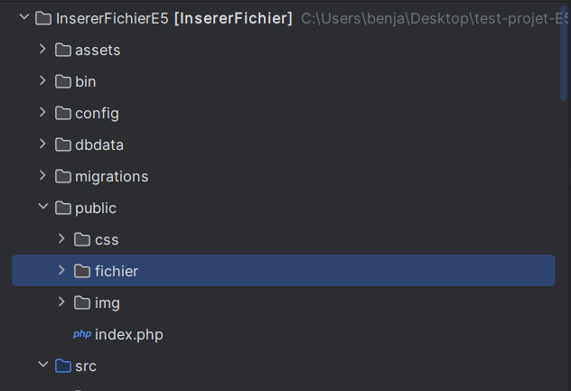

# Guide d'installation
### 1er étape: Création du fichier d'environnement
```bash
    cp .env-exemple .env
```
### 2ème étape: mettre a jour les librairies du composer.json
```bash
    composer update
```
### 3ème étape: Démarrage des conteneurs docker
```bash
    docker-compose up -d
```
### 4ème étape: création du fichier d'execution de la BDD
```bash
    symfony console make:migration
```
### 5ème étape: Déploiement de la BDD
```bash
    symfony console d:m:m
```

### 6ème étape: Déploiement des fixtures
Attention les tables fichier_demande et fichier_bilan non pas de fixture et doivent être créer manuellement pour le fonctionnement du site web
```bash
    symfony console d:f:l
```
### 7ème étape: remplacer les chemins d'accès sur certain controller
Étant un site de gestion de fichiers (par exemple : Word, PDF), un chemin d'accès a été défini pour stocker ces fichiers et les visualiser. Il faut obligatoirement que le chemins d'accès pointe vers le dossier fichier qui se situe dans public



Liste des controller a changé:

- FichierBilanController: l.203
- FichierDemandeController: l.135